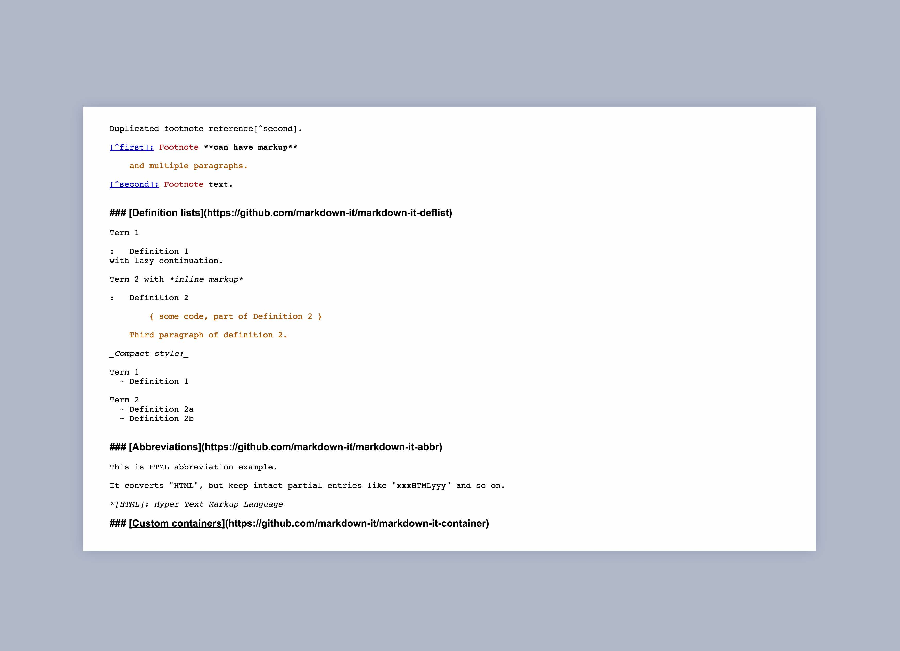

# Minimal Markdown Editor

A minimal Markdown editor with inline style support. Derived from [CodeMirror](https://github.com/codemirror/codemirror).

## Setup

*Note for Windows and Linux users: remove `fsevents` from `package.json`*

1. `npm i` 

1. `grunt`

1. https://docs.standardnotes.org/extensions/local-setup/

## Support

Please open a new issue and the Standard Notes team will take a look as soon as we can. For more information on editors, refer to the following link:

- Standard Notes Help: [What are editors?](https://standardnotes.org/help/77/what-are-editors)

## License

[GNU AGPL v3.0](https://choosealicense.com/licenses/agpl-3.0/)

