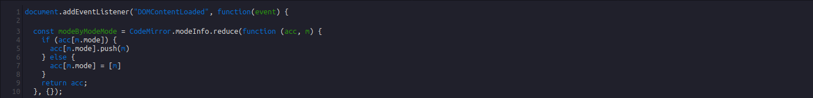

# Code Editor

The Code Editor is a Standard Notes derived editor that provides syntax highlighting and keyboard shortcuts for over 120 programming languages. 

## Quickstart

Use your browser to see the Code Editor in action.

1. Clone the [code-editor](https://github.com/standardnotes/code-editor) repository from GitHub.

2. Run `yarn` to install required dependencies.
   
3. Open `index.html` in your browser where the editor will be running.

## Local Installation

See the editor in the desktop app and make changes to the code.

1. Clone the [code-editor](https://github.com/standardnotes/code-editor) repository from GitHub.

2. Run `yarn` to install required dependencies.
   
3. Ensure that either the Standard Notes desktop app is available for use or the web app is accessible. Use both locally or with an Extended account (or the extension will not load).

4. Follow the instructions [here](https://docs.standardnotes.org/extensions/local-setup) to setup the extension locally.

5. Begin development! Upon making any changes to the code, run `yarn build` to build the files to the `dist` folder.

## Contributing

Feel free to create a pull request, we welcome your enthusiasm!

## Support

Please open a new issue and the Standard Notes team will take a look as soon as we can. For more information on editors, refer to the following link:

- Standard Notes Help: [What are editors?](https://standardnotes.org/help/77/what-are-editors)

We are also reachable on our forum, Slack, Reddit, Twitter, and through email:

- Standard Notes Help and Support: [Get Help](https://standardnotes.org/help)

## License

[GNU AGPL v3.0](https://choosealicense.com/licenses/agpl-3.0/)