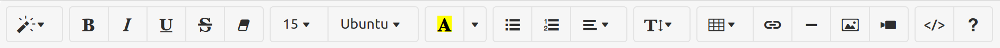

# Plus Editor

The Plus Editor is a Standard Notes derived editor that is perfect for crafting any document. Converts note to HTML.

## Quickstart

Use your browser to see the Plus Editor in action.

1. Clone this repository
1. Run `yarn` to install dependencies
1. Run `yarn start` to start local dev server
1. Open `http://localhost:8001` in your browser

## Contributing

Feel free to create a pull request, we welcome your enthusiasm!

## Support

Please open a new issue and the Standard Notes team will take a look as soon as we can. For more information on editors, refer to the following link:

- Standard Notes Help: [What are editors?](https://standardnotes.org/help/77/what-are-editors)

We are also reachable on our forum, Slack, Reddit, Twitter, and through email:

- Standard Notes Help and Support: [Get Help](https://standardnotes.org/help)
## License

[GNU AGPL v3.0](https://choosealicense.com/licenses/agpl-3.0/)