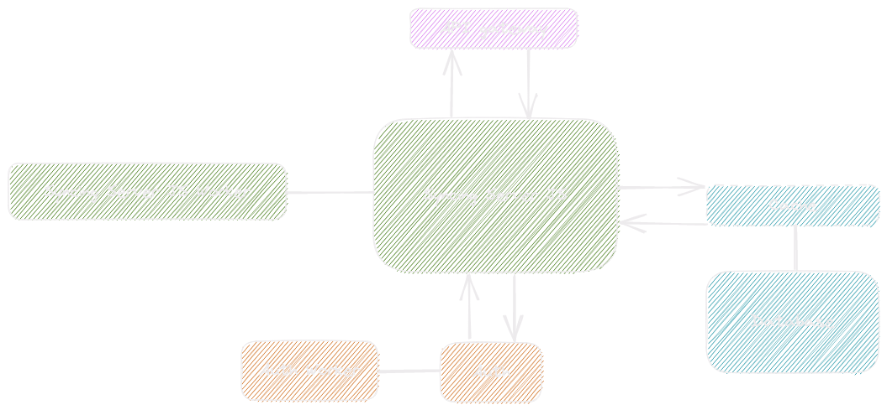

Our self-hosted server infrastructure consists of several different microservices responsible for different functionality sets. The self-hosted server works as the _backend_ that processes and stores your data; it does not include the web application. The web application is an optional process that you must spin up separately. However, you can use the [existing web app](https://app.standardnotes.com) or the official Standard Notes desktop app with your self-hosted server.

:::tip Quick start

The fastest and easiest way to get up and running is to use our automated Docker scripts. All you need is a Linux server and the latest version of [Docker](https://docs.docker.com/get-started) along with [Docker-Compose](https://docs.docker.com/compose/install) installed. [Check out the Docker page for more details →](./docker.md)

:::

## Infrastructure overview

The Syncing Server infrastructure consists of several different microservices, each responsible for various functionalities.

### Syncing Server JS

Syncing Server JS is a [TypeScript](https://www.typescriptlang.org/) implementation of our [Syncing Server](https://github.com/standardnotes/app/tree/main/packages/snjs). This service is the core of the Standard Notes business logic and is responsible for all operations on user data.

### Syncing Server JS Worker

Syncing Server JS Worker is responsible for all asynchronous tasks that the Syncing Server JS may offload for background processing. This service includes processing email backups, resolving issues with duplicate notes, sending notes to extensions, and much more.

### Auth

This server is responsible for all authorization and authentication mechanisms within Standard Notes. This service is also where all account-related metadata is handled and processed.

### Auth Worker

Similar to Syncing Server JS Worker, the Auth Worker is responsible for all asynchronous tasks related to the domain of authentication and authorization. Processing account deletion requests and users' post-registration tasks are processes handled by the Auth Worker.

### API Gateway

This service is the main entry point of the entire architecture. The API Gateway is a router and proxy for all services inaccessible directly. All requests from client applications will have to go through API Gateway to reach a specific underlying service. This service is paired with your reverse proxy for HTTPS support.

### Database

A MySQL server handles the database and is where all data is stored. Encrypted, obviously.

### Cache

Standard Notes uses a Redis cache node to store all temporary data for performance optimization and auto-expiring features. In self-host mode, Redis is used by default as a communication queue between services and their workers.

## Troubleshooting

If you run into any issues setting up your server, please [open an issue on GitHub](https://github.com/standardnotes/standalone/issues) or reach out on the [Standard Notes Slack](https://standardnotes.com/slack).

## Web application

If you would like to self-host the actual Standard Notes web application, visit the [repository for the Standard Notes web app on GitHub](https://github.com/standardnotes/app/tree/main/packages/web).

## Building from source

Dealing with the entire architecture of Standard Notes can be challenging without full knowledge of how the syncing server and its microservices function. Because of this, we do not offer any support for this method of self-hosting. [The only supported self-hosting method is to use the Docker scripts →](./docker.md)

