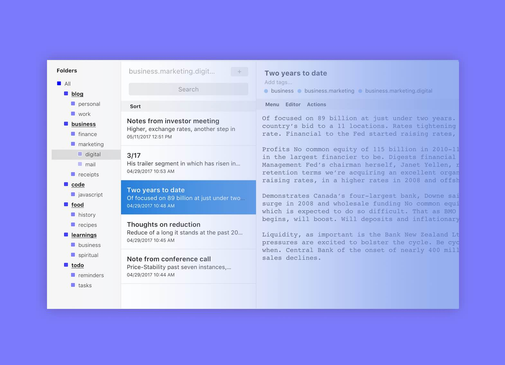

# Folders

Folders is a desktop/web component to create nested folders from your tags with easy drag and drop. Folders also supports Smart Tags, which allow you to build custom filters for viewing your notes. 

## Setup

Run `npm install` (for dependencies) and `grunt` (to build).

Follow the instructions [here](https://docs.standardnotes.org/extensions/local-setup) to setup the extension locally. Make sure the `area` is set to `tags-list`.

## Support

Please open a new issue and the Standard Notes team will take a look as soon as we can.

## License

[GNU AGPL v3.0](https://choosealicense.com/licenses/agpl-3.0/)